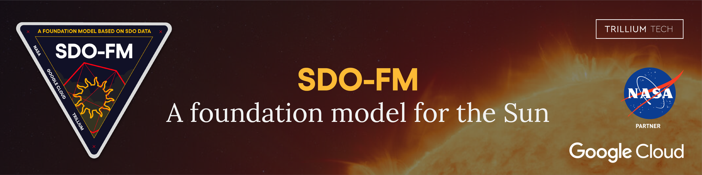

[](https://black.readthedocs.io/en/stable/)
<h2 align="center">SDO-FM: A foundation model for the Sun</h2>


<p align="center">
<a href="https://github.com/psf/black/blob/main/LICENSE"></a>
<a href="https://github.com/psf/black"></a>
<a href="https://wandb.ai/fdlx/sdofm/"></a>
<a href="https://console.cloud.google.com/cloud-build/builds?project=sdo-fm-2024"></a>
<a href="https://github.com/spaceml-org/SDO-FM/actions/workflows/black.yml"></a>
</p>

<p>SDO-FM is a prototype foundation model that integrates data from SDO’s HMI and AMI instruments to encapsulate the Sun's dynamics within an embedding space. Encapsulating the Sun's complex physical interactions in a multi-modal model unlocks the potential for many downstream investigations, lowering the complexity and costs for machine learning in solar physics.  Building a small fine-tuned adapter can be done for a fraction of the cost of building an AI model with classical methods. </p>

<p>SDO-FM consists of four key components: an ingestion pipeline to create machine learning ready datasets, model architecture and training, embeddings and fine-tunable models, and downstream fine-tuned applications. SDO-FM utilizes existing datasets (SDOMLv2) and well defined downstream tasks. </p>

<p>The engineering focused on adapting two model architectures to the SDO dataset, and building a benchmarking harness for scientific validation. Training was engineered for a TPU-distributed approach, designed to be compute-agnostic and aligned with industry best practices.</p>

<p>SDO-FM was built using a science-led approach and active involvement of the scientific community.  Validation tasks for the prototype as well as future proposed validation tasks were chosen through a series of workshops and feedback from heliophysics researchers, teams building other foundation models in weather prediction, climate science, and earth sciences, and SDO instrument experts. This collaborative approach will help us optimize the model for useful downstream applications and adapt to emerging tools and methodologies.</p>

#### Downstream validation tasks
<p>The model is validated by adapting the embeddings and comparing outcomes against published known results using classical machine learning methods. The four validation tasks used were predicting the Earth’s thermospheric density (F10.7), reconstructing missing channels, autocalibration of the AIA instrument, and the virtualization of the broken MEGS-A instrument (Virtual EVE).<p>

The project will also investigate if the foundation model can either replicate or leverage [SDOML](https://sdoml.org) (the data product developed in FDL.AI). 

#### Repo structure
```bash
├── assets              # images for this readme
├── experiments         # configuration files for different trials 
├── notebooks           # visualisation/testing ipynb
├── scripts             # entrypoint and highest level executors
├── sdofm               # python package
│   ├── ablation        # models without backbone integration
│   ├── benchmarks      # metrics for comparison
│   ├── datasets        # dataloaders/modules
│   ├── finetuning      # modules for finetuning
│   ├── models          # model components 
│   ├── pretraining     # modules for pretraining
└── └── visualisation   # various graphing utilities
```

## Datasets

| Name 	| Description 	| Granularity & Source 	|
|---	|---	|---	|
|  NASA’s Solar Dynamics Observatory (SDO) [Pesnell et al. 2012](https://ui.adsabs.harvard.edu/link_gateway/2012SoPh..275....3P/doi:10.1007/s11207-011-9841-3)  | Three instruments:<br><ul><li>Atmospheric Imaging Assembly (AIA) 2 ultraviolet, 1600 & 1700 Å 7 extreme ultraviolet, 94, 131, 171, 193, 211, 304, and 335 Å.</li><li>Helioseismic and Magnetic Imager (HMI) - visible filtergrams processed into: photospheric Dopplergrams line-of-sight magnetograms vector magnetograms.</li><li>EUV Variability Experiment (EVE) - EUV spectral irradiance from 1 to 1050 Å. MEGS disperse EUV light from full disk of the Sun and corona onto a charge coupled device.</li></ul> | 4096x4096 12 second cadence:<br>AIA - [Lemen et al. 2012](https://ui.adsabs.harvard.edu/link_gateway/2012SoPh..275...17L/doi:10.1007/s11207-011-9776-8).<br>HMI - [Hoeksema et al. 2014](https://ui.adsabs.harvard.edu/link_gateway/2014SoPh..289.3483H/doi:10.1007/s11207-014-0516-8).<br>1024 x 2048: <br>EUV - [Woods et al. 2012](https://ui.adsabs.harvard.edu/link_gateway/2012SoPh..275..115W/doi:10.1007/s11207-009-9487-6).<br>Downsampled 512x512/0.6, 512x512/0.5 arcsec 6 (AIA) 12 (HMI) minute cadence for machine learning: [Galvez et al. 2019](https://iopscience.iop.org/article/10.3847/1538-4365/ab1005) via [sdoml.org](sdoml.org). |

## Models
### Backbones
| Name 	| Paper	|
|---	|---	|
| Masked Autoencoders Are Scalable Vision Learners 	| He, Kaiming, et al. "Masked autoencoders are scalable vision learners." Proceedings of the IEEE/CVF conference on computer vision and pattern recognition. 2022 ([link](https://openaccess.thecvf.com/content/CVPR2022/papers/He_Masked_Autoencoders_Are_Scalable_Vision_Learners_CVPR_2022_paper.pdf))	|
| Foundation Models for Generalist Geospatial Artificial Intelligence (Prithvi) 	| Jakubik, Johannes, et al. "Foundation models for generalist geospatial artificial intelligence." arXiv preprint arXiv:2310.18660 (2023) ([link](https://arxiv.org/pdf/2310.18660.pdf)) 	|
| NVAE: A Deep Hierarchical Variational Autoencoder 	| Vahdat, Arash, and Jan Kautz. "NVAE: A deep hierarchical variational autoencoder." Advances in neural information processing systems 33 (2020): 19667-19679 ([link](https://arxiv.org/abs/2007.03898))    |

### Heads
| Name 	| Paper	|
|---	|---	|
| Multichannel autocalibration for the Atmospheric Imaging Assembly using machine learning 	| Dos Santos, Luiz FG, et al. "Multichannel autocalibration for the Atmospheric Imaging Assembly using machine learning." Astronomy & Astrophysics 648 (2021): A53 ([link](https://www.aanda.org/articles/aa/full_html/2021/04/aa40051-20/aa40051-20.html)) 	|
| Virtual EVE: a Deep Learning Model for Solar Irradiance Prediction | Indaco, Manuel, et al. "Virtual EVE: a Deep Learning Model for Solar Irradiance Prediction." (2023) ([link](https://ml4physicalsciences.github.io/2023/files/NeurIPS_ML4PS_2023_236.pdf)) 	|

## Setup
### Installation
SDO-FM can be installed locally by directly installing the package in this repository.
```bash
pip install -e .
```

### Usage
To run any task we assume execution inside a container with the image described in the [Dockerfile](Dockerfile) and Hydra configurations, these are kept in the [experiments](experiments) directory. The entry point is [main.py](scripts/main.py) and args will select a configuration:
```bash
python scripts/main.py --config-name=default
```
CLI overrides are still possible with this selection but be aware of some shells not escaping quotes or sqaure brackets:
```bash
python scripts/main.py --config-name=default experiment.seed=37
```

## Pre-training
```bash
python scripts/main.py --config-name=pretrain_tiny
```


## Fine-tuning
### Science objective 1: Dimming
```bash
python scripts/main.py --config-name=dimming_tiny
```

## Development
### Training a model in GCP Vertex
To train a model in the cloud start by branching off main and prepare your model and experiment configuration.
```bash
git branch -b <NEW_EXPERIMENT>
cd SDO-FM
cp experiments/default.yaml <NEW_EXPERIMENT_CONFIG>.yaml
```
Once ready commit your changes and tag it with a version number of the format `v*.*.*`, e.g. `v0.1.2`
```bash
git add .
git commit -m "Added <NEW EXPERIMENT>"
git tag v0.1.2
git push -u origin <NEW_EXPERIMENT>
git push --tags
```
This will trigger an action to build this repository state in Google Cloud Build, it takes around 10 mins :tea:. Once completed it will be available in W&B as a job [here](https://wandb.ai/fdlx/sdofm/jobs). To run it, select "Launch" and define your overrides, e.g.
```yaml
{
    "args": [
        "--config-name=<NEW_EXPERIMENT_CONFIG>",
        "experiment_name=<NEW_EXPERIMENT_RUN>",
    ],
    "run_config": {},
    "entry_point": ["/src/scripts/main.py"]
}
```
Set your compute resources abiding by [this table](https://cloud.google.com/vertex-ai/docs/training/configure-compute), e.g.
```yaml
MACHINE_TYPE: a2-ultragpu-8g
ACCELERATOR_TYPE: NVIDIA_A100_80GB
ACCELERATOR_COUNT: 8
```


## Citation 
```bib
@software{SDOFM_2024,
    title           = {{Solar Dynamics Observatory Foundation Model}},
    repository-code = {https://github.com/spaceml-org/SDO-FM},
    year            = {2024}
}
```

# Acknowledgement

This work is the research product of the SDO-FM: A Multi-Modal Foundation Model POC for SDO. This has been funded and supported by NASA under **Grant award No 80NSSC24K0701**. Any opinions, findings, and conclusions or recommendations expressed in this material are those of the authors and do not necessarily reflect the views of the National Aeronautics and Space Administration (NASA). The research and its outputs have been designed, managed and delivered by Trillium Technologies Inc (https://trillium.tech). Trillium is a research and development company with a focus on intelligent systems and collaborative communities for planetary stewardship, space exploration and human health. Trillium aspires to ensure that the latest tools and techniques in Artificial Intelligence (AI) and Machine Learning (ML) are applied to developing open science for all Humankind.


